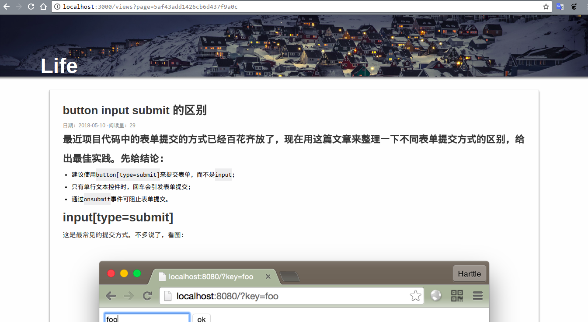

项目描述
===========================
这是一个基于node的博客，拥有博客基本的前后台功能。

****
## 启动方式
下载到本地后，cd到当前目录，安装package.json所需依赖包，然后启动入口文件
```javascript
node app.js
```

## 项目使用条件
- [x] nodejs环境
- [x] mongodb

## 页面所拥有功能如下
```
后台：
1.后台用户管理；
2.博客分类及增删改查；
3.博客文章及增删改查（文章内容支持markdown）；

前台：
1.导航；
2.文章及分页；
3.登录注册；
4.文章页；

```

## 涉及技术
```
mongodb
swig模版
express

```

## 页面效果

* 首页


* 文章页


* 后台界面


## License
[MIT](/LICENSE)

